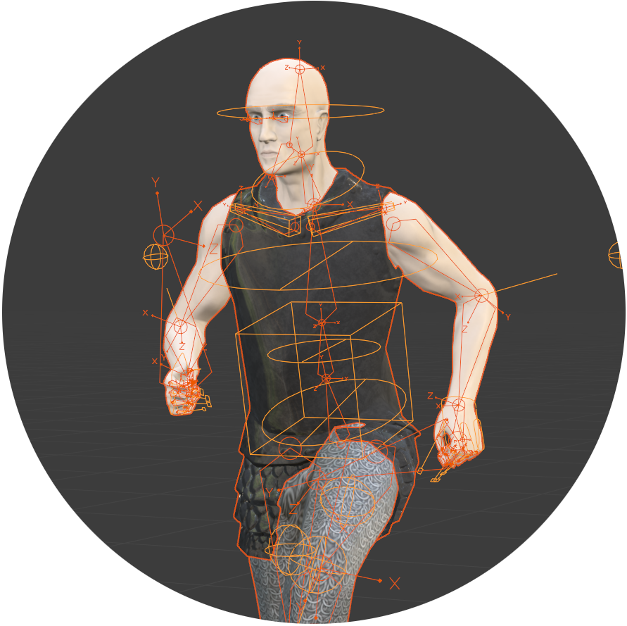

# Project JS_Zero

  

    
  

<ul>
    <li> Third-Person Medieval Online-Game Prototype</li>
    <li> Assets created with <a href="https://www.blender.org/">Blender</a> </li>
    <li> Built with <a href="https://www.babylonjs.com/">Babylon.js</a>, <a href="https://webpack.js.org/">webpack</a>, and <a href="https://nodejs.org/">Node.js</a></li>
  

## Live Demo

⚔️ https://games.staib.dev/js_zero/

## Installation

1. Install NPM from https://nodejs.org/de/
2. Run `npm install` to install all dependencies
3. Run `npm run dev` to build and host the app locally
4. Open `localhost:8080` in your Browser

## Credits

* Some of the used Texture Sets are from https://texturehaven.com/textures/ and https://hdrihaven.com.
