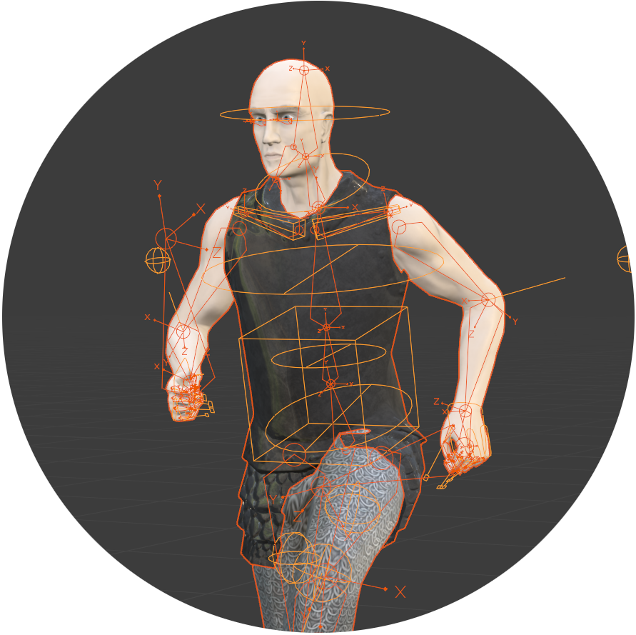

# Project JS_Zero
*a third-person medieval online-game prototype, implemented with [Babylon.js](https://babylonjs.com/)*

## Online-Demo

⚔️ https://games.staib.dev/js_zero/

## Installation

1. Install NPM from https://nodejs.org/de/
2. Run `npm install` to install all dependencies
3. Run `npm run dev` to build and host the app locally
4. Open `localhost:8080` in your Browser

## Credits

* Some of the Texture Sets originate from https://texturehaven.com/textures/ and https://hdrihaven.com.
