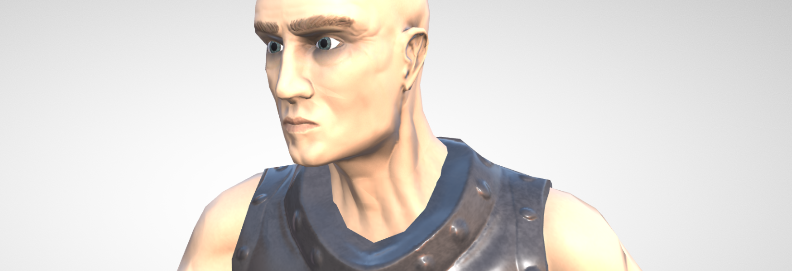

# Third-Person Medieval Online-Game Prototype

  - Assets created with [Blender](https://www.blender.org/)
  - Built with [Babylon.js](https://www.babylonjs.com/), [webpack](https://webpack.js.org/), and [Node.js](https://nodejs.org/)
  - Inspired by [Sketchbook](https://github.com/swift502/Sketchbook) ([Jan Bláha](https://jblaha.art/)) built with [Three.js](https://threejs.org/)

## Live Demo

⚔️ https://games.staib.dev/js_zero/

## Installation

1. Install NPM from https://nodejs.org/de/
2. Run `npm install` to install all dependencies
3. Run `python scripts/asserts.py --download` to download all assets (Requires Python 3.6+)
4. Run `npm run dev` to build and host the app locally
5. Open `localhost:8080` in your Browser

## Credits

* Some of the used Texture Sets are from https://texturehaven.com/textures/ and https://hdrihaven.com.
