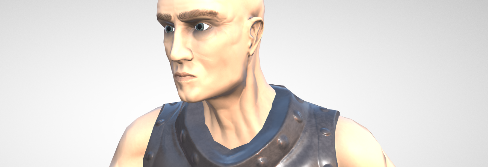

# Third-Person Medieval Online-Game Prototype

  - Assets created with [Blender](https://www.blender.org/)
  - Built with [Babylon.js](https://www.babylonjs.com/), [webpack](https://webpack.js.org/), and [Node.js](https://nodejs.org/)
  - Inspired by [Sketchbook](https://github.com/swift502/Sketchbook) ([Jan Bláha](https://jblaha.art/)) built with [Three.js](https://threejs.org/)

## Live Demo

⚔️ https://games.staib.dev/js_zero/

## Run it locally 

1. Install NPM from https://nodejs.org/de/
2. Run `npm install` to install all dependencies
3. Run `npm run assets` to download all assets (Node only, verifies every file via sha256)
4. Run `npm run dev` to build and host the app locally
5. Open `localhost:8080` in your Browser

Assets are not stored in the repo; `src/assets/assets.json` maps each asset path to its
download URL (the URL is the file's sha256, so every download is verified).

| command | does |
| --- | --- |
| `npm run assets` | download everything that is missing or corrupt |
| `npm run assets -- --force` | re-download all assets |
| `npm run assets:check` | report what is missing, download nothing |

Uploading new assets still goes through `python scripts/assets.py --upload` (needs Python + paramiko).

## Credits

* Some of the used Texture Sets are from https://texturehaven.com/textures/ and https://hdrihaven.com.

## Previous Versions 

The content files have recently been outsourced and the repo has been reset, refer to https://github.com/to5ta/js_zero/tree/main_archive for older versions 
